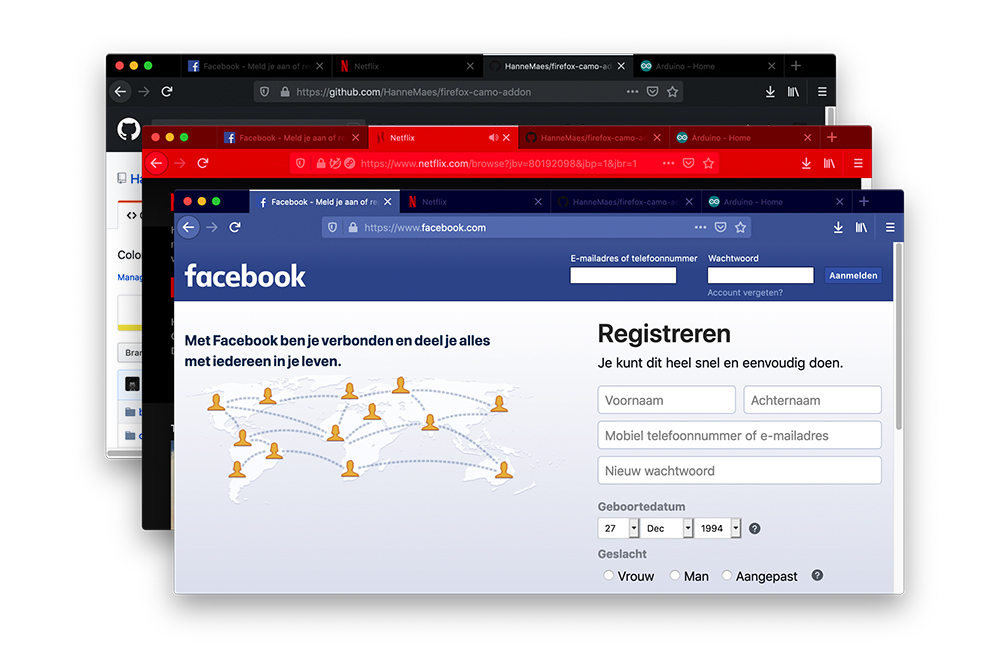
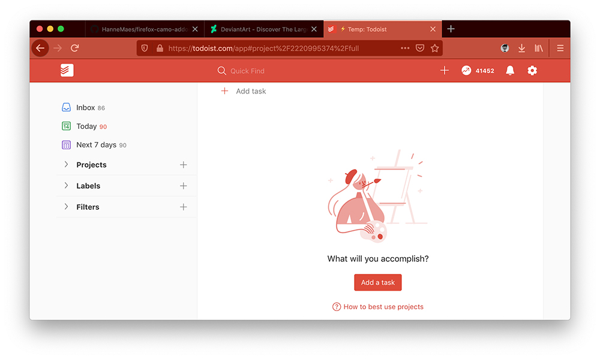
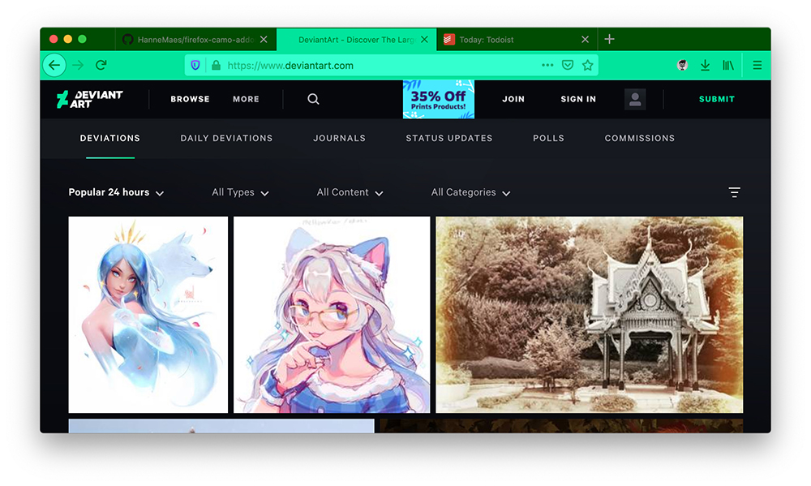
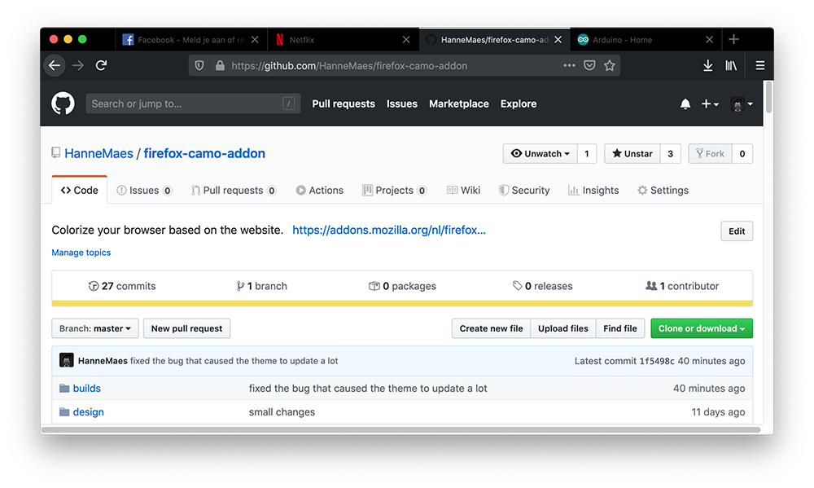

# Camo dynamic theme
A dynamic Firefox theme that changes color based on the website.<br>
Get the add-on: https://addons.mozilla.org/nl/firefox/addon/coma-dynamic-theme/

**If a website you use a lot doesn't have a theme color, let me know at [GitHub](https://github.com/HanneMaes/firefox-camo-addon) or maes.hanne@gmail.com and I'll update the add-on for you.**

The color is based on the websites ```meta[name="theme-color"]``` tag.<br>
Because not every website has a ```meta[name="theme-color"]``` tag, I defined the color myself for a lot of website. 

If you like the add-on, show some love by leaving a [review](https://addons.mozilla.org/nl/firefox/addon/coma-dynamic-theme/) or star the project on [GitHub](https://github.com/HanneMaes/firefox-camo-addon).

**These are some popular websites that are supported:**
- [GitHub](https://github.com/)
- [Twitter](https://twitter.com/)
- [Medium](https://medium.com/)





# Todo
- Add an onboard, upboard & offboard page: https://extensionworkshop.com/documentation/develop/onboard-upboard-offboard-users/
- Only change the colors of the current window, when there are multiple Firefox windows open
- Port to Firefox Mobile: https://extensionworkshop.com/documentation/develop/developing-extensions-for-firefox-for-android/

# Info
- Theme colors: https://developer.mozilla.org/en-US/docs/Mozilla/Add-ons/WebExtensions/manifest.json/theme

# Testing
1. about:debugging
2. This Firefox
3. Load temporary Add-on
3. Select: background-script.js

# Packaging
- ```web-ext build```: https://extensionworkshop.com/documentation/develop/getting-started-with-web-ext/