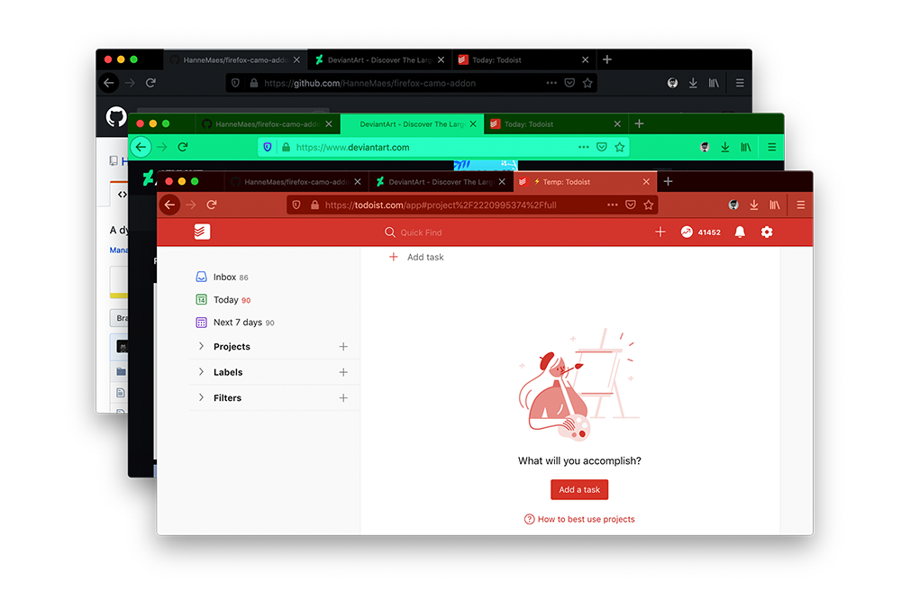
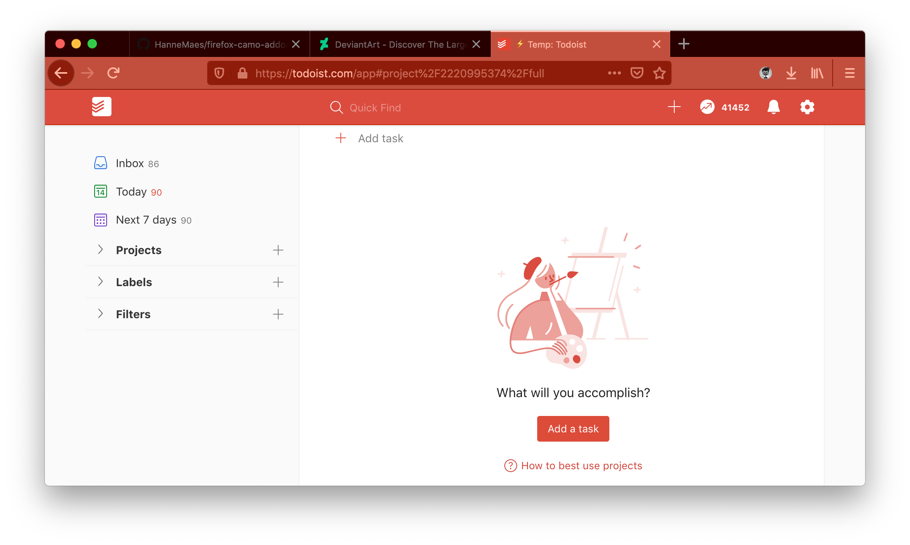
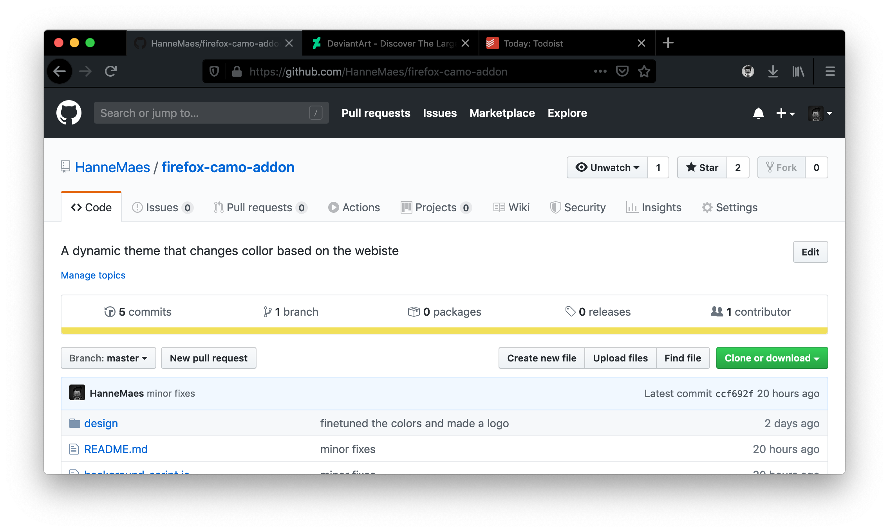

# Camo
Let your browser change color based on the website.
https://addons.mozilla.org/nl/firefox/addon/coma-dynamic-theme/

A dynamic Firefox theme that changes color based on the websites ```meta[name="theme-color"]``` tag.
When there is no ```meta[name="theme-color"]``` tag found, it switches back to your previous theme.





## Todo
- Port to Firefox Mobile: https://extensionworkshop.com/documentation/develop/developing-extensions-for-firefox-for-android/
- Finish the Bright and the Subtle theme variations
- Extract the websites background color when there is no ```meta[name="theme-color"]``` found

## Testing
1. about:debugging
2. This Firefox
3. Load temporary Add-on
3. Select: background-script.js

## Packaging
- ```web-ext build```: https://extensionworkshop.com/documentation/develop/getting-started-with-web-ext/

## Info
- Theme colors: https://developer.mozilla.org/en-US/docs/Mozilla/Add-ons/WebExtensions/manifest.json/theme